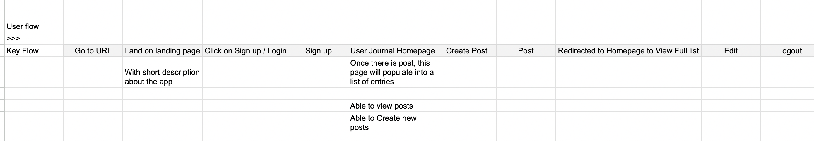
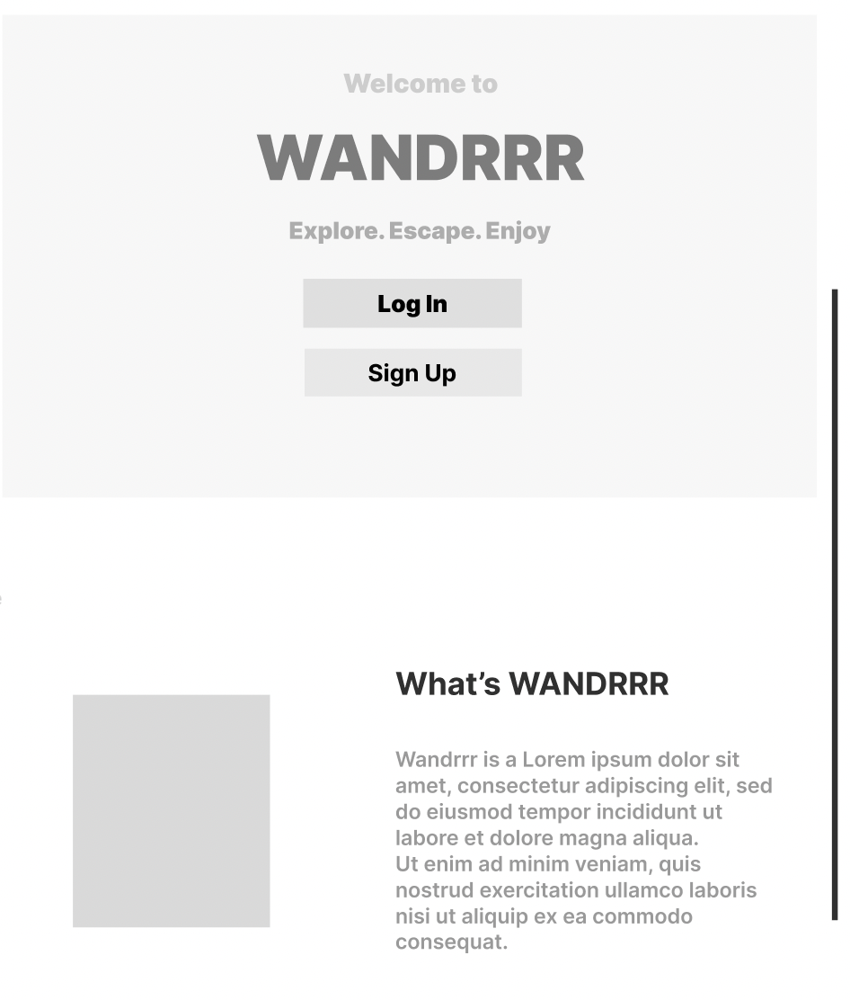
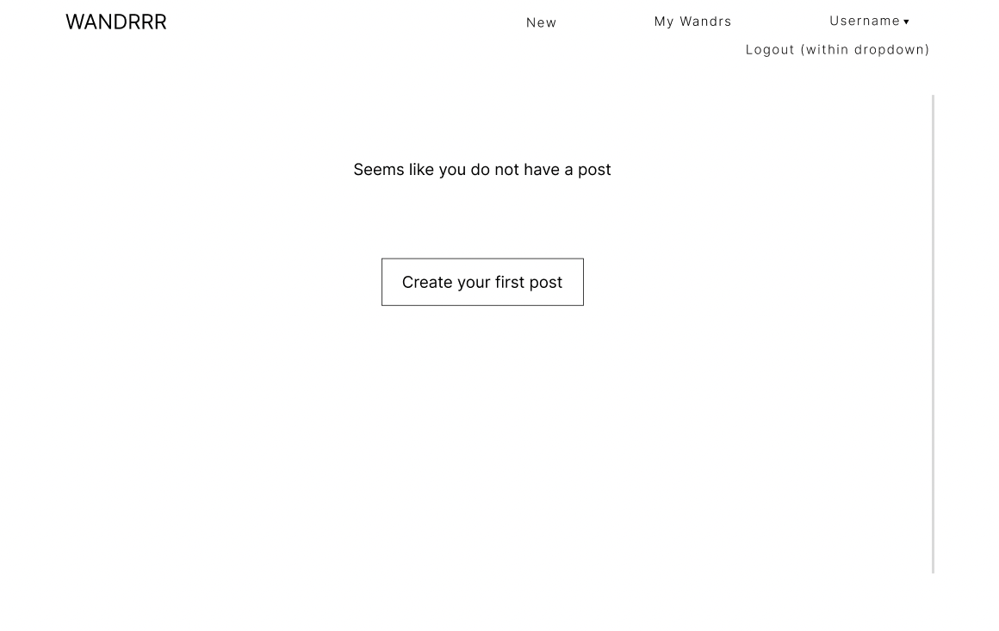
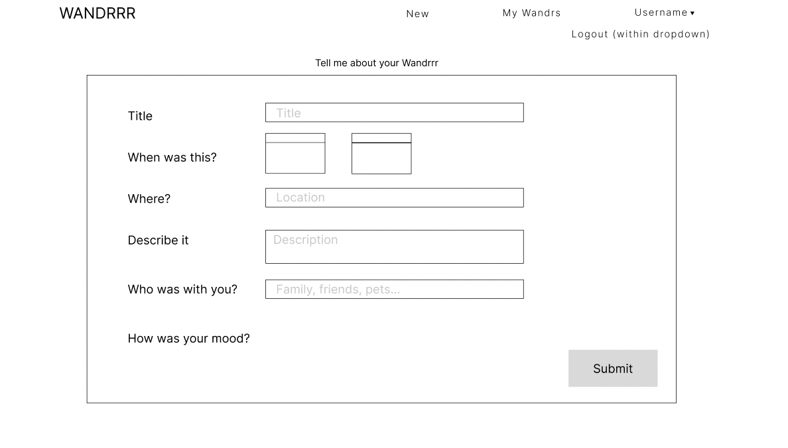
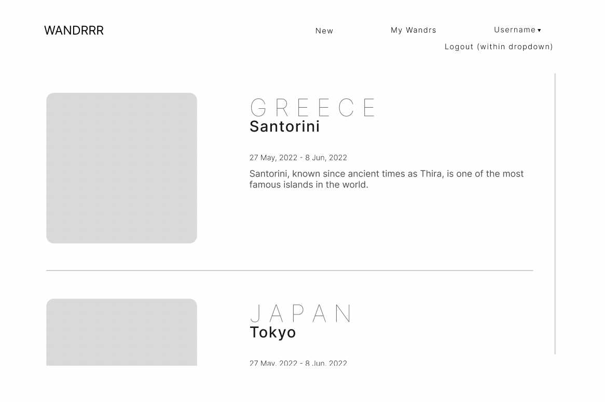
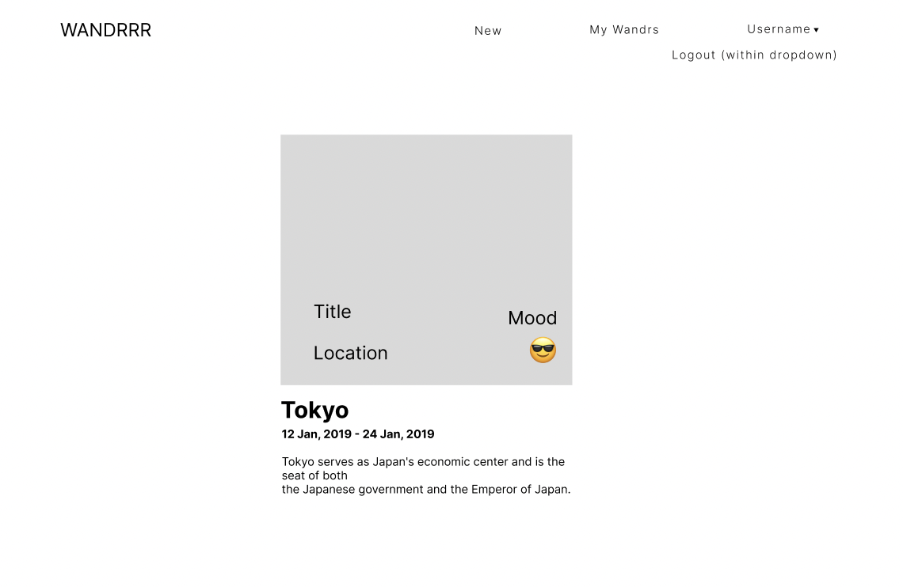

# Wandrrr Wireframes

These wireframes were developed based on the key flow we had mapped out.
 
 

## Landing page
 

## User Sign up
 

## User Log in
 

## Empty Wandrrr List
This is the list page if a user has just signed up or if they delete all of their existing Wandrrrs.
This was the first wireframe where we implemented the nav bar for authenticated users.
The top right would be the user's username that could be hovered to reveal the sign out option.
Later, we also moved the "New Wandrrr" button from the nav bar into the username dropdown.
 
 

## Create Wandrrr
In these early designs, we wanted to allow users to drag and drop image files into the form.
This was later replaced with URL fields to avoid implementation of cloud services.
 
 

## Wandrrr List
Once a user populates the Wandrrr list, they are able to scroll through their own Wandrrrs.
Clicking on a card takes the user to the detail page of that specific card.
We later decided to simplify the list view by saving the descriptions for the detail page.
 
 

## Wandrrr Detail
Instead of the square image size we had originally designed, we went with full size photos.
We thought this would make the photos more immersive for the purpose of our app.
On that same sentiment, we moved the words and emojis to sit above and below the photos
so not even the smallest of details on the photos would get covered up
 
 

